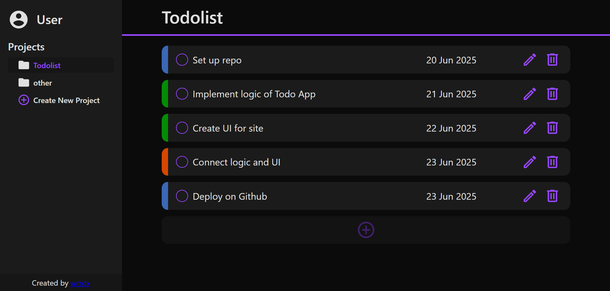

# Todo Application

A task management application built with JavaScript classes and Webpack as part of [The Odin Project](https://www.theodinproject.com/) curriculum.

## Preview

  


**Live Demo**: [https://wrzdx.github.io/Todo-List/](https://wrzdx.github.io/Todo-List/)


## Features
- Project-based task organization
- Due date and priority based task sorting
- LocalStorage persistence


## Key Concepts
✅ JavaScript Classes (OOP)  
✅ Webpack configuration  
✅ LocalStorage data persistence  
✅ Form validation  
✅ Dynamic DOM updates  

## Core Functionality
- Create/Edit/Delete projects and tasks


## How to Run
1. Clone the repository:
```bash
git clone https://github.com/wrzdx/Todo-List.git
```
2. Install dependencies:
```bash
npm install
```
3. Start development server:
```bash
npm run start
```
4. Open `http://localhost:8080` in your browser

For production build:
```bash
npm run build
```


---

*Part of The Odin Project's [JavaScript Course](https://www.theodinproject.com/paths/full-stack-javascript/courses/javascript/lessons/todo-list)*  
*Focuses on JavaScript Classes and LocalStorage*  
